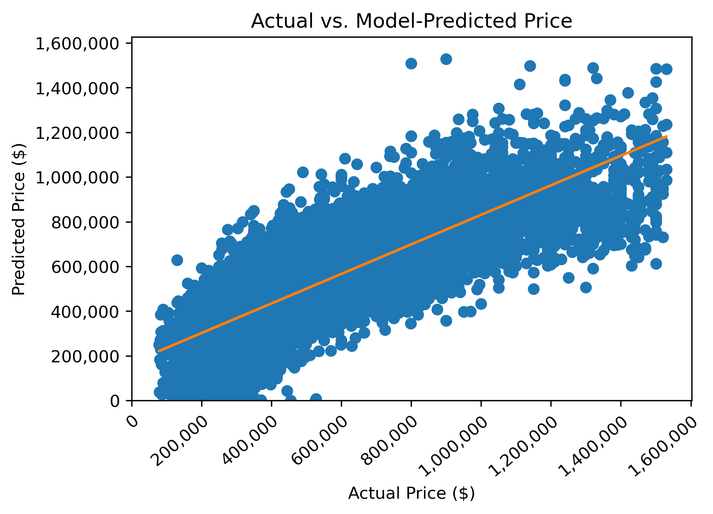
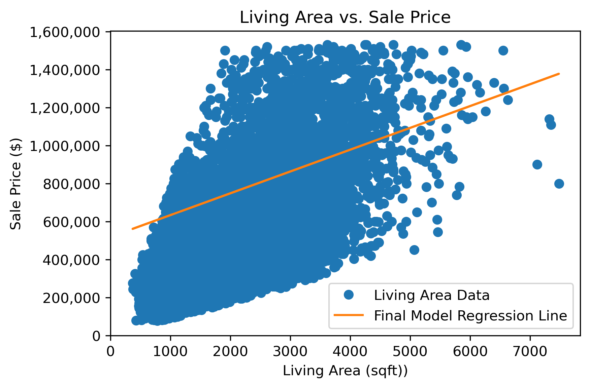
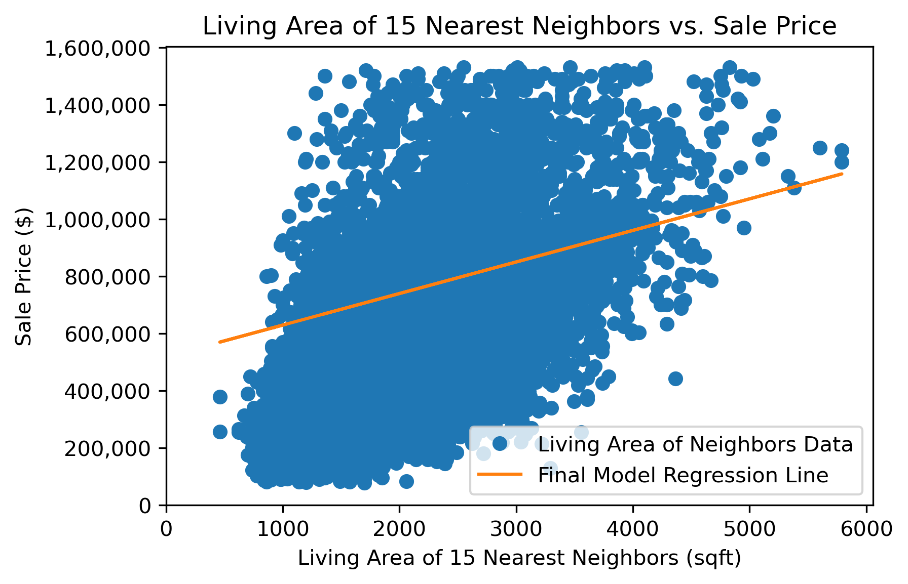
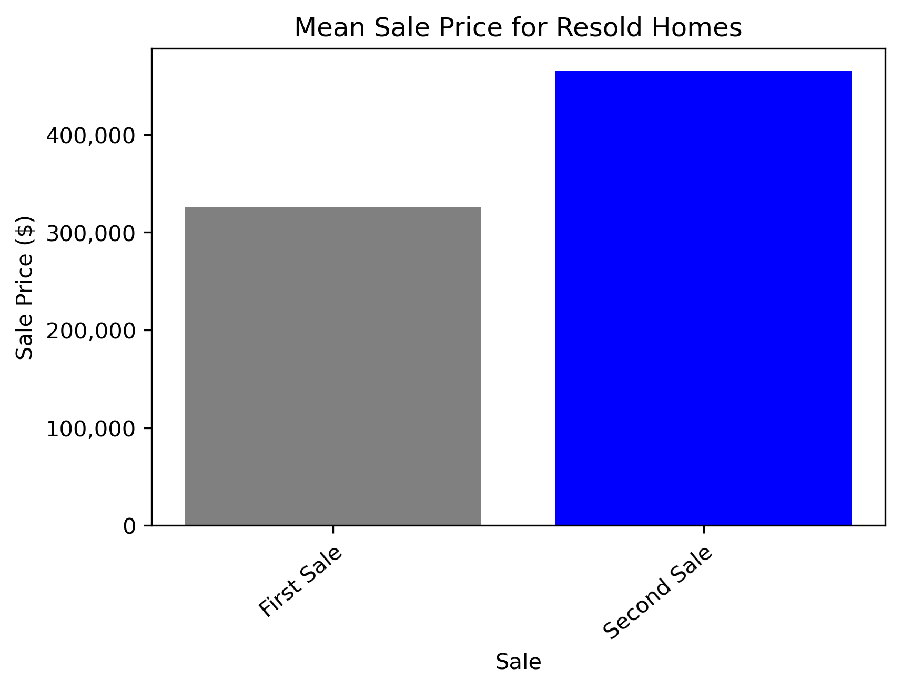

# King County House Sales Project Submission

Authors: Andrew Boucher, Jon McCaffrey


## Overview

For this project, we will be using multiple linear regression modeling to analyze house sales in King County, WA, based on data from May 2014 - May 2015.

### Business Challenge

We will be presenting to a home building and renovation company __[Northwest Builders & Renovation](northwestbnr.com)__ in Seattle, WA.  The premise is they are looking for insight into what features of properties have the greatest impact on sale price.  This information could influence what clients they market to for potential renovation projects as well as what features are most important to consider for new home construction. 

### Data 

The source of our data is housing sale information from a public dataset in King County, WA, which includes >20 features describing each property, containing both numeric and categorical information.  

### Methods

Data exploration and descriptive analysis was performed in Python, using Pandas, Statsmodels, and sklearn, as well as Matplotlib. This was in order to isolate, clean, and organize select variables, correlating them to the most relevant factors affecting sale price.  We then fit and iterated through multiple models to improve each model's ability to explain the variation in sale price.  We repeated this process to investigate the change in house price for houses sold more than once.

## Results

For our final model we obtained an adjusted R-squared value of 0.661, which means our model can explain 66% of the variation in sale price.  This model has a p-value (prob of F-stat) of <0.05 which means we can reject the null hypothesis that there is no relationship between our predictors and the target ("price") and that our model is better at predicting sales price than our baseline model.  

Our final model also passed all assumptions for LINH and multicollinearity.

We had additional models related to resale prices as well, based on a subset of our main dataset. 

For our resale model, we obtained an adjusted R-squared value of 0.197, which means our model can only explain about 20% of the variation in change of *resale* price.  This model has a p-value (prob of F-stat) of <0.05 which means we can reject the null hypothesis that there is no relationship between our predictors and the target ("delta_price") and that our model is better at predicting sales price than our baseline model.  

Our resale model also passed all assumptions for LINH and multicollinearity.  However, we have many features that are not significant for the model.

## Visuals









## Conclusions
In summary, for the business goals of Northwest Builders & Renovation to understand the most relevant factors affecting home sale price, and maximizing marketing possibilities for renovations and new builds, we would recommend focusing on the location of the property, size of the property, and the size of the nearest homes to the property.  Based on the calculations from our final model, there is a decrease in sale price of 16,271 dollars per mile *away* from downtown Seattle, an increase in sale price by 115 dollars per square foot added in the living area of the property, and an increase in sale price of 110 dollars per square foot added in the living area of the nearest 15 homes.  We also found significance in the features of distance from Seattle and year built affecting the change in resale price for properties in our dataset. We found on average, sale prices increased by 42% from first sale to second sale.  


## For More Information

Please review our full analysis in __[our Jupyter Notebook](https://github.com/mccafj/King-County-House-Sales-Project/blob/main/King%20County%20Housing%20notebook.ipynb)__ or our __[presentation](https://github.com/mccafj/King-County-House-Sales-Project/blob/main/King%20County%20Housing%20Slides.pdf)__.

For any additional questions, please contact **Andrew Boucher aboucher1360@gmail.com or Jon McCaffrey jonmccaffrey524@gmail.com**


## Repository Structure

Describe the structure of your repository and its contents, for example:

```
├── README.md                           <- The top-level README for reviewers of this project
├── King County Housing Notebook.ipynb  <- Main notebook for project code
├── King County Housing Slides.pdf      <- PDF of slides for our presentation
├── Data			                          <- Location of raw dataset
└── Images                              <- images used and generated in the project

